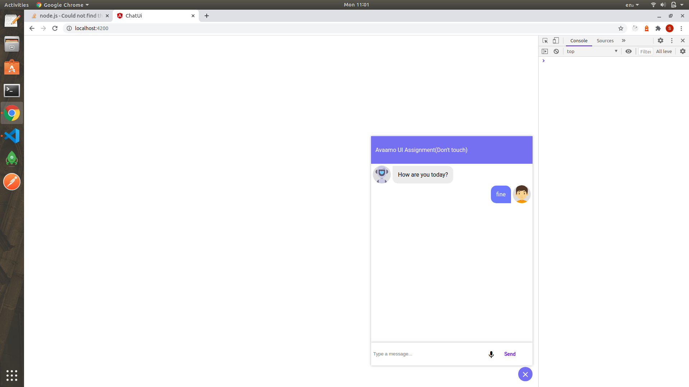
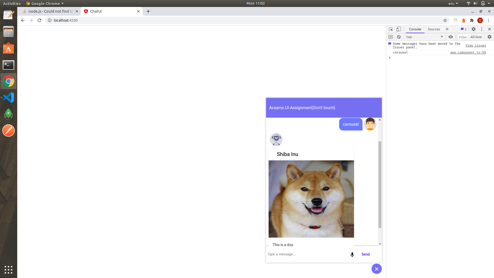
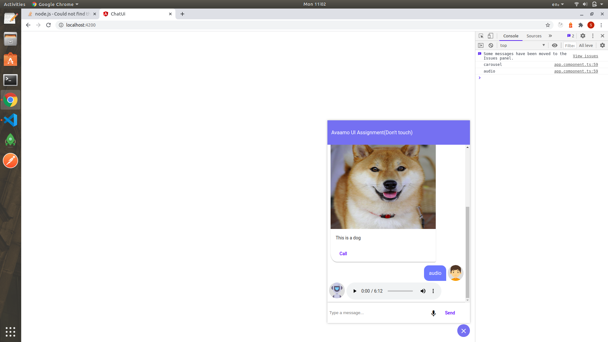
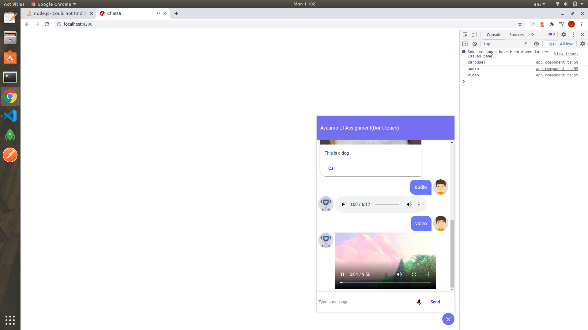

# ChatUi

This project was generated with [Angular CLI](https://github.com/angular/angular-cli) version 7.3.5.

## How to run?    
just clone the repo and run npm i and then run ng serve that's it your project will be running on localhost:4200

## Development server
Run `ng serve` for a dev server. Navigate to `http://localhost:4200/`. The app will automatically reload if you change any of the source files.

## screenshots   
    
    
    

